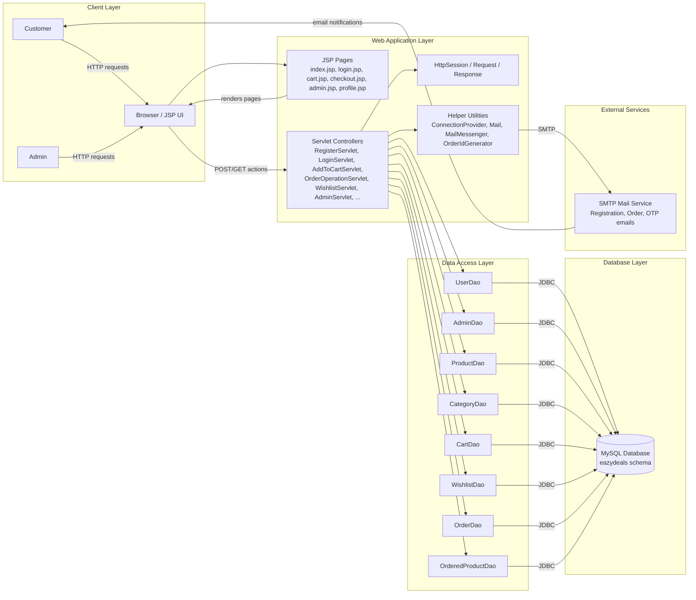
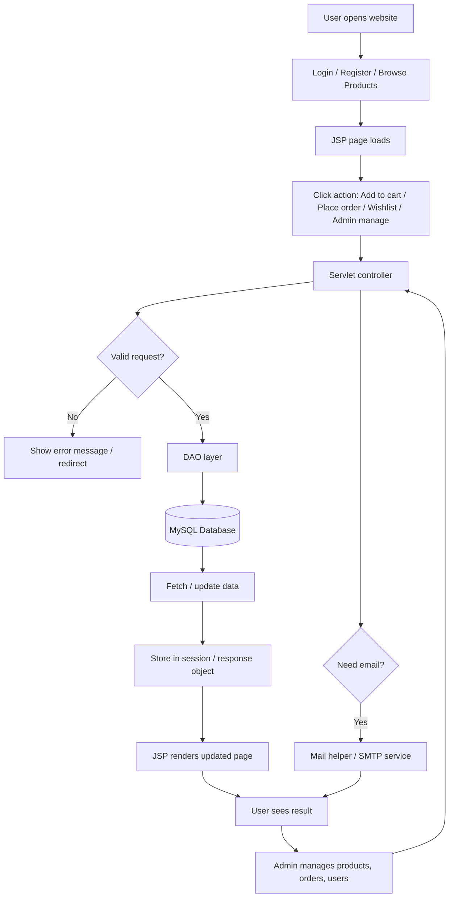

# EazyDeals Architecture

This repository is a Java web application built with JSP, Servlets, JDBC, and MySQL. It follows a classic MVC-style structure where JSP pages provide the UI, servlet classes handle HTTP requests, and DAO classes manage database access.

## Component breakdown

- Front-end: JSP, HTML, CSS, JavaScript, Bootstrap
- Back-end: Java Servlets and Java classes
- Persistence: JDBC DAO layer against MySQL
- Session management: HttpSession for authenticated users/admins
- Mail: registration/order/password-reset email notifications
- Domain model: entities such as User, Product, Category, Cart, Order, Wishlist, and Admin

## Key folders

- [src/main/java/com/eazydeals/servlets](src/main/java/com/eazydeals/servlets) — controller logic
- [src/main/java/com/eazydeals/dao](src/main/java/com/eazydeals/dao) — database operations
- [src/main/java/com/eazydeals/entities](src/main/java/com/eazydeals/entities) — domain models
- [src/main/java/com/eazydeals/helper](src/main/java/com/eazydeals/helper) — database and mail helpers
- [src/main/webapp](src/main/webapp) — JSP pages, static assets, layouts, and UI templates
- [eazydeals_maven.sql](eazydeals_maven.sql) — database schema and seed data

## Flow diagram

## Typical request flow

1. User opens a JSP page in the browser.
2. A servlet receives the request and validates the action.
3. The servlet uses a DAO to query or update the MySQL database.
4. The result is stored in the session or returned to the JSP for rendering.
5. Email notifications are sent when required for registration, password reset, or order updates.
